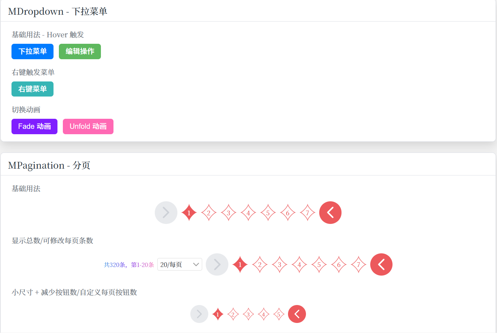
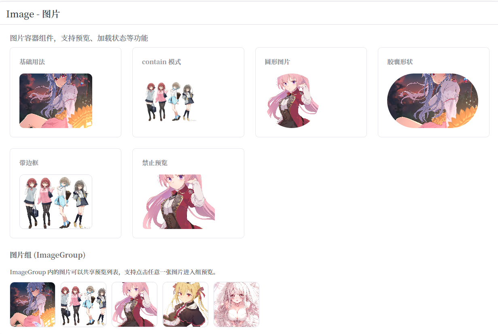
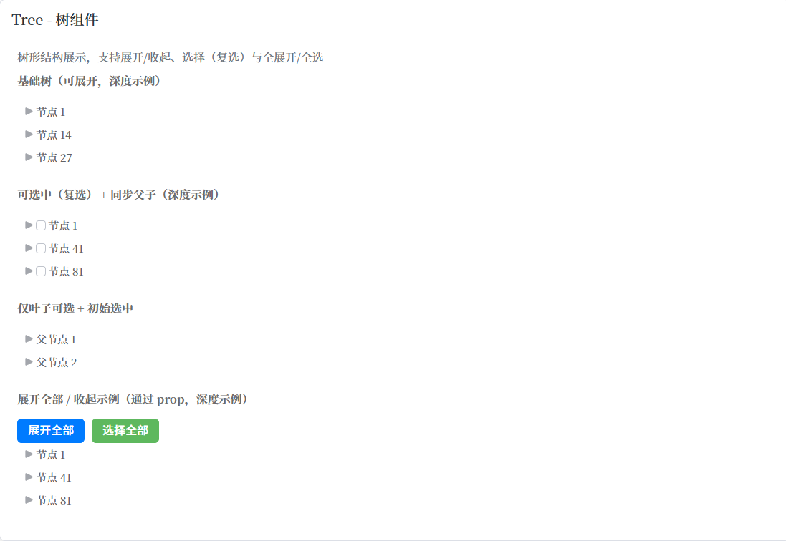
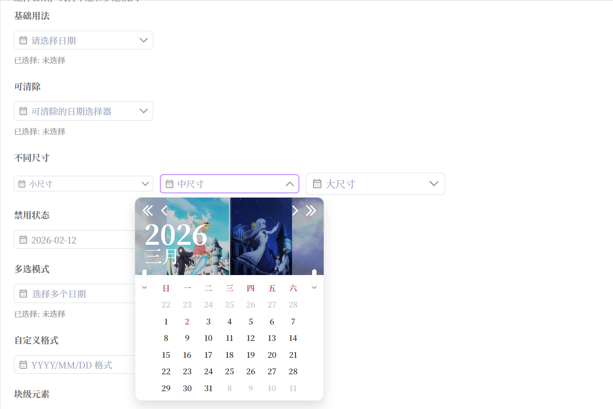
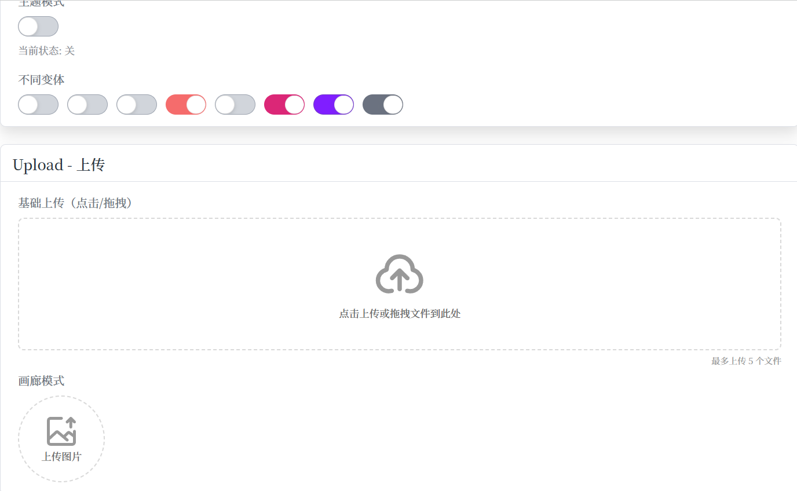
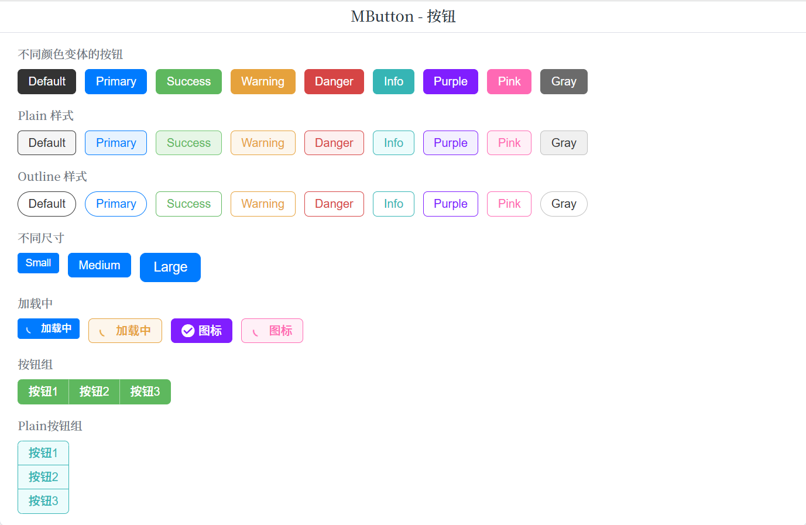
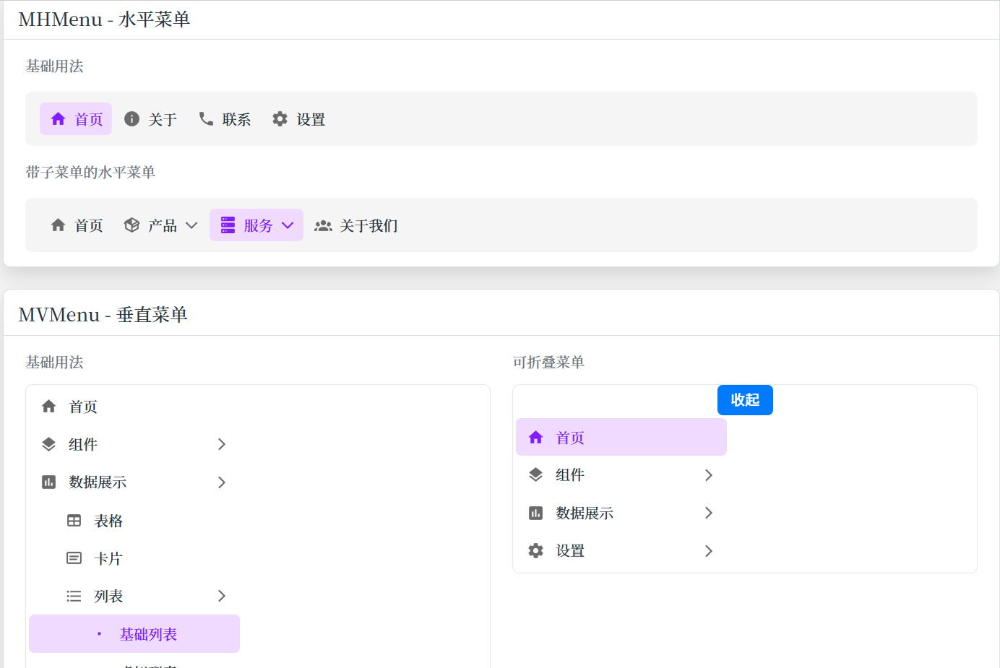
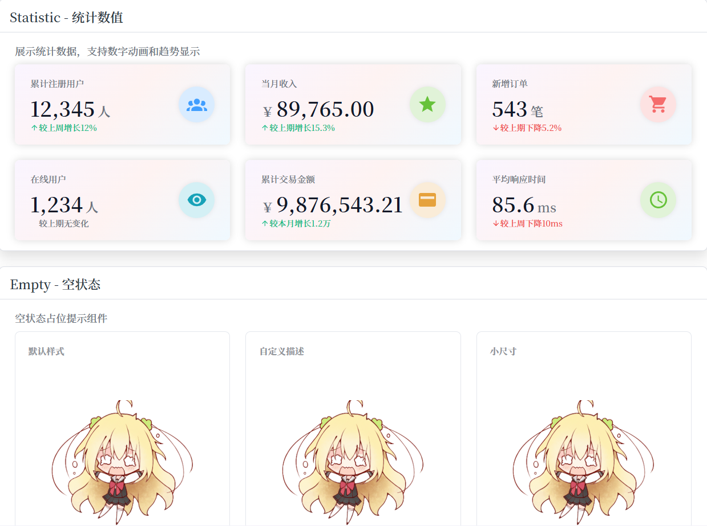

# Michiru UI

> A Vue 3 UI Component Library — 基于 Vue 3 + TypeScript 的轻量级 UI 组件库

这个项目起初仅作为个人博客的内部组件库而存在，并无意发展为一个正式的 UI 框架。随着博客功能的持续迭代，所需组件的数量与复杂度不断增加，最后形成了现在的规模。

## 环境要求

| 工具       | 版本                      |
| ---------- | ------------------------- |
| Node.js    | `^20.19.0` 或 `>=22.12.0` |
| Vue        | `>=3.5.0`                 |
| vue-router | `>=4.2.0`                 |

## 本地使用

本项目尚未发布至 npm，如果你想在你的项目中使用，需在本地构建后通过 `npm link` 或 `npm pack` 的方式引入。

#### 方式一：npm link（推荐开发调试）

```bash
# 1. 克隆项目
git clone https://github.com/HrqstnMichiru/michiru-ui.git
cd michiru-ui

# 2. 安装依赖
npm install

# 3. 构建库
npm run build

# 4. 在本项目目录下注册全局链接
npm link

# 5. 在你的目标项目中链接
cd your-project
npm link michiru-ui
```

#### 方式二：npm pack（离线安装）

```bash
# 在本项目目录下打包
npm run build
npm pack
# 生成 michiru-ui-x.x.x.tgz

# 在目标项目中安装
cd your-project
npm install /path/to/michiru-ui-x.x.x.tgz
```

## 依赖说明

在使用本库前，请确保项目中已安装以下依赖：

- `vue`
- `vue-router`

本库采用 **@iconify/vue** 作为图标解决方案，图标名称可以在[Iconify](https://icones.js.org/)中查看和搜索。

## 快速开始

#### 全量注册

```ts
import { createApp } from "vue";
import MichiruUI from "michiru-ui";
import "michiru-ui/style.css";
import App from "./App.vue";

createApp(App).use(MichiruUI).mount("#app");
```

#### 按需导入

```ts
import { MButton, MInput } from "michiru-ui";
import "michiru-ui/style.css";
```

## 组件列表

#### 基础组件 `basic`

| 组件      | 说明         |
| --------- | ------------ |
| Button    | 按钮         |
| Divider   | 分割线       |
| Icon      | 图标         |
| Flex      | 弹性容器     |
| Grid      | 网格容器     |
| ScrollBar | 自定义滚动条 |
| Split     | 分割面板     |

#### 数据录入 `data`

| 组件          | 说明         |
| ------------- | ------------ |
| CheckBox      | 复选框       |
| DatePicker    | 日期选择器   |
| Form          | 表单         |
| Input         | 输入框       |
| InputTag      | 标签输入框   |
| NumberInput   | 数字输入框   |
| RadioBox      | 单选框       |
| Rating        | 评分         |
| Segmented     | 分段控制器   |
| Select        | 下拉选择     |
| Switch        | 开关         |
| TimeSelect    | 时间选择     |
| TreeSelect    | 树形选择     |
| Upload        | 文件上传     |
| VirtualSelect | 虚拟列表选择 |

#### 数据展示 `display`

| 组件            | 说明     |
| --------------- | -------- |
| Card            | 卡片     |
| Collapse        | 折叠面板 |
| Ellipsis        | 文本省略 |
| Empty           | 空状态   |
| Gradient        | 渐变文字 |
| Image           | 图片     |
| Link            | 链接     |
| NumberAnimation | 数字动画 |
| Progress        | 进度条   |
| Statistic       | 统计信息 |
| Table           | 表格     |
| Tag             | 标记     |
| Timeline        | 时间线   |
| Tree            | 树形控件 |
| VirtualList     | 虚拟列表 |
| WaterFall       | 瀑布流   |

#### 反馈 `feedback`

| 组件         | 说明       |
| ------------ | ---------- |
| Alert        | 警告提示   |
| Dialog       | 对话框     |
| Drawer       | 抽屉       |
| Loading      | 加载中     |
| Message      | 全局提示   |
| Modal        | 模态框     |
| Notification | 通知提醒   |
| Overlay      | 遮罩层     |
| Popconfirm   | 气泡确认框 |
| Popover      | 气泡卡片   |
| Result       | 结果页     |
| Tooltip      | 文字提示   |

#### 导航 `navigation`

| 组件       | 说明     |
| ---------- | -------- |
| Breadcrumb | 面包屑   |
| Dropdown   | 下拉菜单 |
| Menu       | 导航菜单 |
| Pagination | 分页     |
| Tab        | 标签页   |

## 预览组件

`examples/` 目录下包含所有组件的预览页面。为避免影响库的构建，该目录**默认不包含在 `tsconfig.app.json` 中**。

若需在浏览器中查看组件效果，请先将 `examples` 文件加入编译范围：

将 [tsconfig.app.json](tsconfig.app.json) 修改为：

```json
{
    "extends": "@vue/tsconfig/tsconfig.dom.json",
    "include": ["env.d.ts", "src/**/*.ts", "src/**/*.vue", "examples/**/*.ts", "examples/**/*.vue"],
    "exclude": ["src/**/__tests__/*", "node_modules", "dist", "docs"],
    "compilerOptions": {
        "tsBuildInfoFile": "./node_modules/.tmp/tsconfig.app.tsbuildinfo",
        "declaration": true, // 允许生成声明文件
        "emitDeclarationOnly": true, // 只生成声明文件
        "noEmit": false, // 允许生成编译产物，包括声明文件和 JavaScript 文件
        "paths": {
            "@/*": ["./src/*"]
        }, // 路径别名配置
        "outDir": "./dist", // 输出目录
        "noUncheckedIndexedAccess": false // 允许访问可能未定义的数组元素
    }
}
```

然后运行：

```bash
# 启动开发服务（默认端口 6753）
npm run dev
```

> **注意**：构建库前请将 `include` 恢复为原始状态，避免将预览文件打包进产物。

### WaterFall 预览说明

本组件库包含瀑布流组件 `WaterFall`。如果需要在预览界面中查看该组件，请先完成以下步骤：

1. 将需要展示的图片放置到 `examples/images` 目录下。
2. 在项目根目录运行以下命令，生成图片信息文件 `data.json`：

```bash
npm run generate
```

生成结果位于 `examples/results/data.json`。

## 预览效果

     
   

## 后续更新计划

### 新增组件

| 组件             | 说明           |
| ---------------- | -------------- |
| Label            | 标签文本       |
| Popselect        | 气泡选择       |
| Popdown          | 气泡下拉       |
| VirtualWaterFall | 虚拟瀑布流     |
| List             | 列表           |
| Anchor           | 锚点导航       |
| Backtop          | 回到顶部       |
| TimePicker       | 时间选择器     |
| DateTimePicker   | 日期时间选择器 |

### 现有组件优化

| 组件       | 优化内容                                           |
| ---------- | -------------------------------------------------- |
| Upload     | 文件列表缩略图根据文件类型动态变化；添加 CRUD 动画 |
| Tabs       | 新增 `segmented`、`card` 风格                      |
| Drawer     | 支持边框拖动调整尺寸                               |
| Table      | 使用 `<col>` 标签重构列宽控制逻辑                  |
| Breadcrumb | 路由切换动画                                       |
| Pagination | 功能拓展（快速跳转、自定义页码、更多尺寸等）       |
| Tree       | 支持节点拖拽、勾选、懒加载、搜索过滤等操作         |
| Image      | 支持图片懒加载                                     |

## 支持本项目

如果这个项目对你有所帮助，欢迎点一个 ⭐ Star，这对我是很大的鼓励！

如果你在使用过程中遇到问题或发现 Bug，欢迎提交 [Issue](../../issues)，我会尽快跟进处理。

也欢迎提交 Pull Request 参与贡献，一起让这个组件库更完善。

## License

本项目基于 [MIT License](./LICENSE) 开源协议发布，你可以自由地使用、修改和分发本项目，但需保留原始版权声明。

Copyright © 2026 Hrqstn Michiru. All rights reserved.
